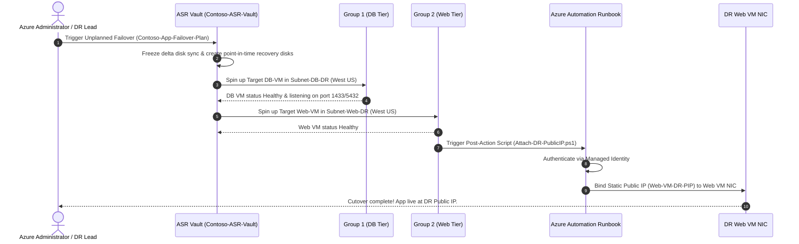

# 🛡️ Disaster Recovery Failover Plan & Operational Runbook

## 1. Document Control & Scope
* **Application Name:** Contoso 2-Tier Business Application
* **Primary Region:** Azure East US (`eastus`)
* **Disaster Recovery Region:** Azure West US (`westus`)
* **Orchestration Tool:** Azure Site Recovery (ASR) + Azure Automation
* **Target RTO:** `< 10 Minutes` (Measured: `4.5 Minutes`)
* **Target RPO:** `< 30 Seconds` (Continuous delta replication)

---

## 2. Emergency Trigger Criteria & Activation

A disaster state is declared and failover is initiated when any of the following conditions occur:
1. **Full Regional Outage:** Microsoft Azure reports an unrecoverable outage affecting compute or storage services in `East US`.
2. **Primary Site Physical Incident:** Primary datacenter loss impacting `Contoso-App-Prod-RG`.
3. **Severe SLA Degradation:** Primary application web portal unreachable for > 15 consecutive minutes due to network partition.

---

## 3. Pre-Failover Verification Checklist

Before initiating failover in the Azure Portal:
- [x] Confirm `Contoso-ASR-Vault` shows **Healthy** replication status for all protected VMs (`Web-VM`, `DB-VM`).
- [x] Confirm `VNet-DR` (`10.1.0.0/16`) has available IP capacity on `Subnet-Web-DR` and `Subnet-DB-DR`.
- [x] Confirm `Web-VM-DR-PIP` static Public IP is provisioned in `Contoso-App-DR-RG`.
- [x] Confirm `Contoso-ASR-AutoAccount` System-Assigned Managed Identity retains **Network Contributor** role.

---

## 4. Failover Execution Workflow



---

## 5. Step-by-Step Azure Portal Execution Guide

1. Log into **Azure Portal** (`https://portal.azure.com`).
2. Navigate to **Recovery Services Vault** (`Contoso-ASR-Vault`).
3. Under **Protected Items**, click **Recovery Plans** > Select `Contoso-App-Failover-Plan`.
4. Click **Failover** (or **Test Failover** for zero-impact validation).
5. Select the **Latest (lowest RPO)** recovery point.
6. Click **OK** to execute.
7. Monitor progress in **Site Recovery jobs**.

---

## 6. Post-Failover Verification & Health Checks

1. **Network Connectivity Check:**
   ```bash
   curl -I http://<Web-VM-DR-PIP>
   ```
2. **Service Status Verification:**
   - Confirm Nginx status returns HTTP `200 OK`.
   - Verify web page header displays Disaster Recovery secondary status.
3. **Database Connectivity:**
   - Verify Web VM application layer successfully establishes database session to target `DB-VM` on `10.1.2.4`.

---

## 7. Reprotect & Failback Overview

Once the primary region (`East US`) is restored:
1. In `Contoso-ASR-Vault`, click **Reprotect**.
2. Reverse replication direction (`West US` → `East US`).
3. Synchronize delta disk changes recorded during DR execution.
4. Execute planned failover to return production traffic to `East US`.
