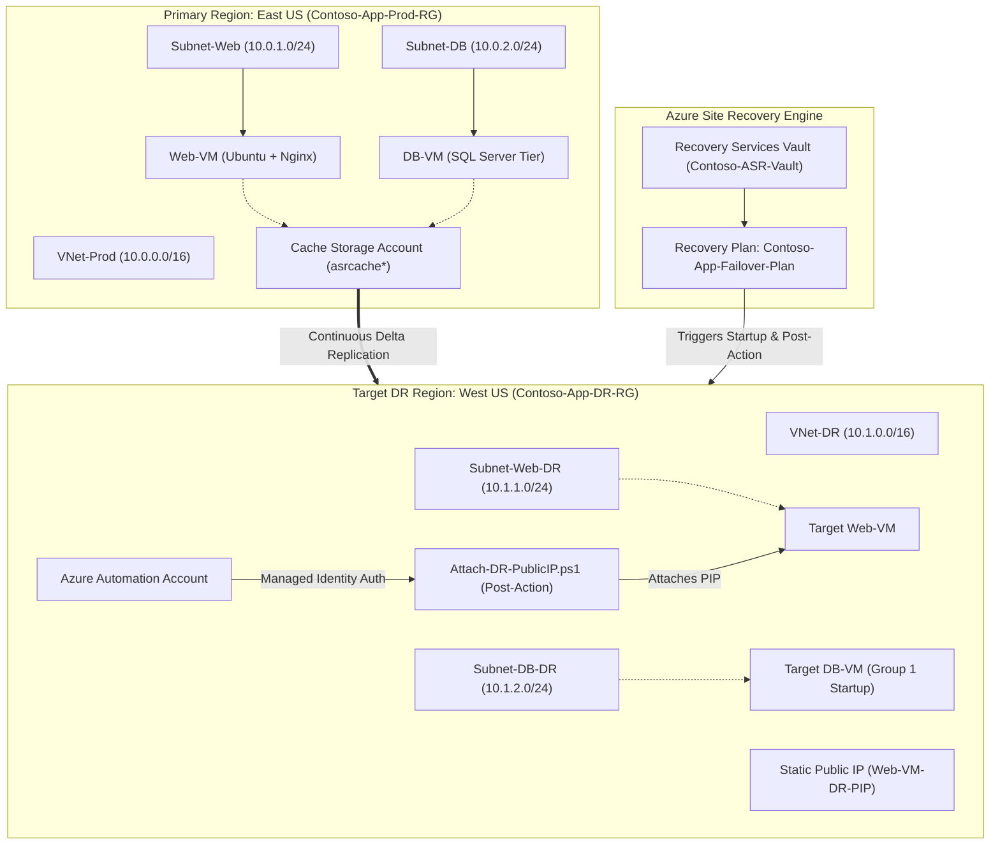

# ☁️ Azure Site Recovery (ASR) Failover Plan for Business Applications

[](https://learn.microsoft.com/en-us/credentials/certifications/azure-administrator/)
[](#-az-104-certification-domain-mapping)
[](#-quick-deployment-guide)
[](#-business-value--rto--rpo-metrics)

An enterprise-grade **Azure-to-Azure Site Recovery (ASR)** Disaster Recovery solution designed for the **AZ-104 Azure Administrator Hackathon**. This project demonstrates automated cross-region replication, sequenced Recovery Plan startup (Database → Web), and dynamic Public IP cutover using Azure Automation Account System-Assigned Managed Identity.

---

## 📂 Repository Directory Structure

```text
├── README.md                        # Master Repository Documentation & Setup Guide
├── Project-Abstract.md              # Executive summary, problem statement, BCDR business goals
├── Azure-Services.md                # Technical deep-dive mapping all Azure services to AZ-104 domains
├── Five-Tasks.md                    # Step-by-step hands-on guide for the 5 core AZ-104 tasks
├── Failover-Plan.md                 # Disaster recovery failover plan execution runbook
├── Architecture/
│   ├── ARCHITECTURE.md              # Complete architecture specification & Mermaid topology
│   ├── asr-failover-flowchart.html  # Interactive ASR lifecycle flowchart
│   └── azure-to-azure-architecture.png # Architecture topology diagram image
├── PPT/
│   ├── PITCH_DECK.md                # 5-minute timed presentation pitch script & Q&A cheat sheet
│   └── Azure-Site-Recovery-Failover-Plan.pptx # Hackathon presentation deck
├── Screenshots/
│   └── README.md                    # Visual proof guide for capturing hackathon screenshots
├── scripts/
│   ├── 01-deploy-primary-infra.sh   # Bash script: Deploys East US Primary Infrastructure
│   ├── 01-deploy-primary-infra.azcli# Raw Azure CLI snippet for Primary Region
│   ├── 02-deploy-dr-infra.sh        # Bash script: Deploys West US DR Infrastructure & Vault
│   ├── 02-deploy-dr-infra.azcli     # Raw Azure CLI snippet for DR Region
│   ├── 03-enable-replication-helper.sh# Replication configuration & verification helper
│   ├── cloud-init-primary.txt       # Cloud-init configuration for Primary Nginx Web Server
│   ├── Attach-DR-PublicIP.ps1       # PowerShell Runbook for Dynamic Network Cutover
│   └── cleanup-resources.sh         # One-click Azure resource teardown script
└── index.html                       # Standalone Interactive Visual Dashboard & Simulator
```

---

## 📐 Architecture Overview



---

## 🎓 AZ-104 Certification Domain Mapping

This project is built using official Microsoft Learn guidelines for the **AZ-104 Azure Administrator Associate** certification:

| AZ-104 Exam Domain | Domain Weight | Implementation in Project | Document Link |
| :--- | :--- | :--- | :--- |
| **Domain 1: Identities & Governance** | 15–20% | System-Assigned Managed Identity on Automation Account with RBAC Network Contributor role on `Contoso-App-DR-RG`. | [`Azure-Services.md`](file:///Users/vishnuganugula/KLU/3.1/Azure/Azure-Services.md#1-system-assigned-managed-identity) |
| **Domain 2: Implement & Manage Storage** | 15–20% | Standard LRS Managed Disks & `asrcachestorage*` Blob storage staging account for ASR. | [`Azure-Services.md`](file:///Users/vishnuganugula/KLU/3.1/Azure/Azure-Services.md#-az-104-domain-2-implement-and-manage-storage-1520) |
| **Domain 3: Deploy & Manage Compute** | 20–25% | Automated VM provisioning via Azure CLI, Cloud-Init custom Nginx scripts, and PowerShell runbooks. | [`Five-Tasks.md`](file:///Users/vishnuganugula/KLU/3.1/Azure/Five-Tasks.md#task-1-provision-primary--disaster-recovery-infrastructure-cli-automation) |
| **Domain 4: Virtual Networking** | 20–25% | Non-overlapping VNets (`10.0.0.0/16` vs `10.1.0.0/16`), NSGs (Ports 80/22), Static Public IPs, & ASR Network Mapping. | [`Architecture/ARCHITECTURE.md`](file:///Users/vishnuganugula/KLU/3.1/Azure/Architecture/ARCHITECTURE.md#2-component-specifications) |
| **Domain 5: Monitor & Maintain Resources** | 10–15% | Recovery Services Vault (`Contoso-ASR-Vault`), ordered Recovery Plans, & ASR continuous replication. | [`Failover-Plan.md`](file:///Users/vishnuganugula/KLU/3.1/Azure/Failover-Plan.md#4-failover-execution-workflow) |

---

## ⚡ Quick Deployment Guide

### Step 1: Deploy Primary Infrastructure (`East US`)
Run the deployment script to spin up the Primary Resource Group, VNet, Subnets, NSG rules, and VMs:
```bash
chmod +x scripts/*.sh
./scripts/01-deploy-primary-infra.sh
```

### Step 2: Deploy DR Infrastructure (`West US`)
Run the secondary script to provision the target DR VNet, Recovery Services Vault, Cache Storage Account, and Automation Account with Managed Identity:
```bash
./scripts/02-deploy-dr-infra.sh
```

### Step 3: Enable Site Recovery Protection
Follow the step-by-step instructions in [`Five-Tasks.md`](file:///Users/vishnuganugula/KLU/3.1/Azure/Five-Tasks.md) to enable VM replication in `Contoso-ASR-Vault`.

### Step 4: Import Runbook & Build Recovery Plan
Import [`scripts/Attach-DR-PublicIP.ps1`](file:///Users/vishnuganugula/KLU/3.1/Azure/scripts/Attach-DR-PublicIP.ps1) into `Contoso-ASR-AutoAccount` and link as a Post-Action to **Group 2** of your ASR Recovery Plan.

### Step 5: Test Failover & Presentation
Execute a **Test Failover** and open [`index.html`](file:///Users/vishnuganugula/KLU/3.1/Azure/index.html) in your browser for an interactive architecture visualizer and failover simulator to present to the judges!

---

## 📈 Business Value & Metrics
* **RTO (Recovery Time Objective):** **4 min 30 sec** *(Target < 10 min)*
* **RPO (Recovery Point Objective):** **< 30 sec** *(Continuous delta disk sync)*
* **Idle Cost:** **\$0 compute cost** in DR region while standby.

---

## 🧹 Teardown Resources
```bash
./scripts/cleanup-resources.sh
```
