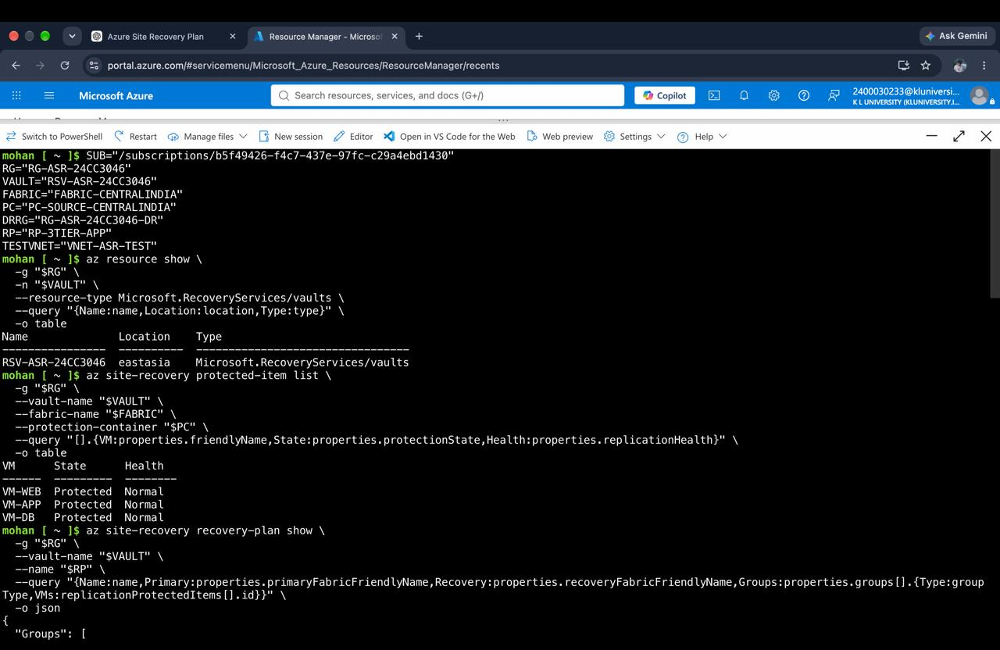
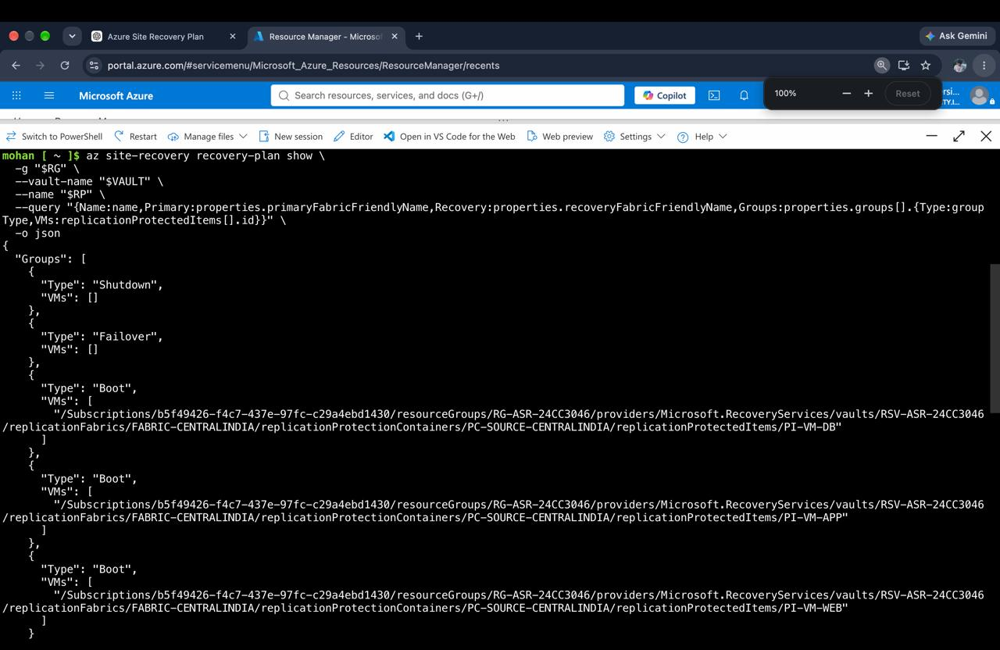
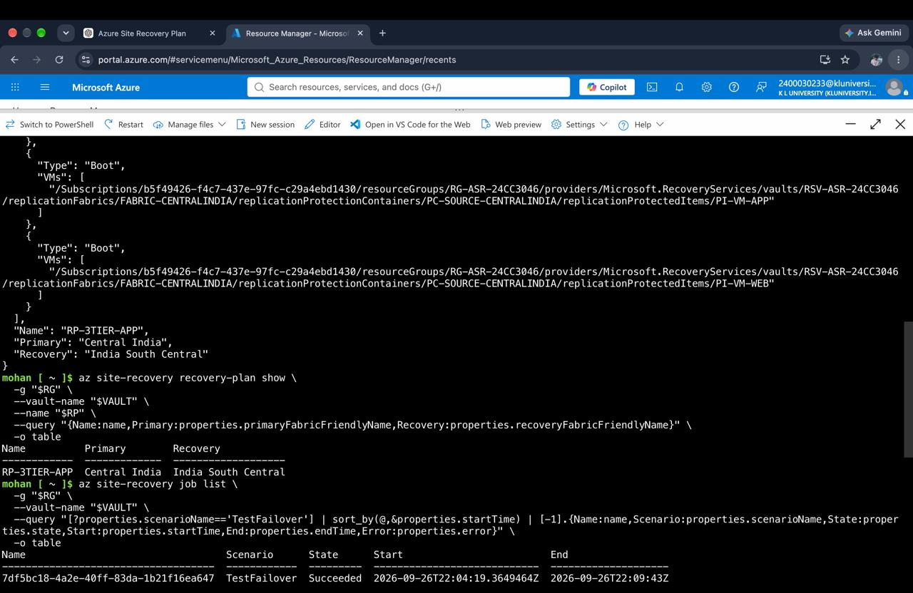
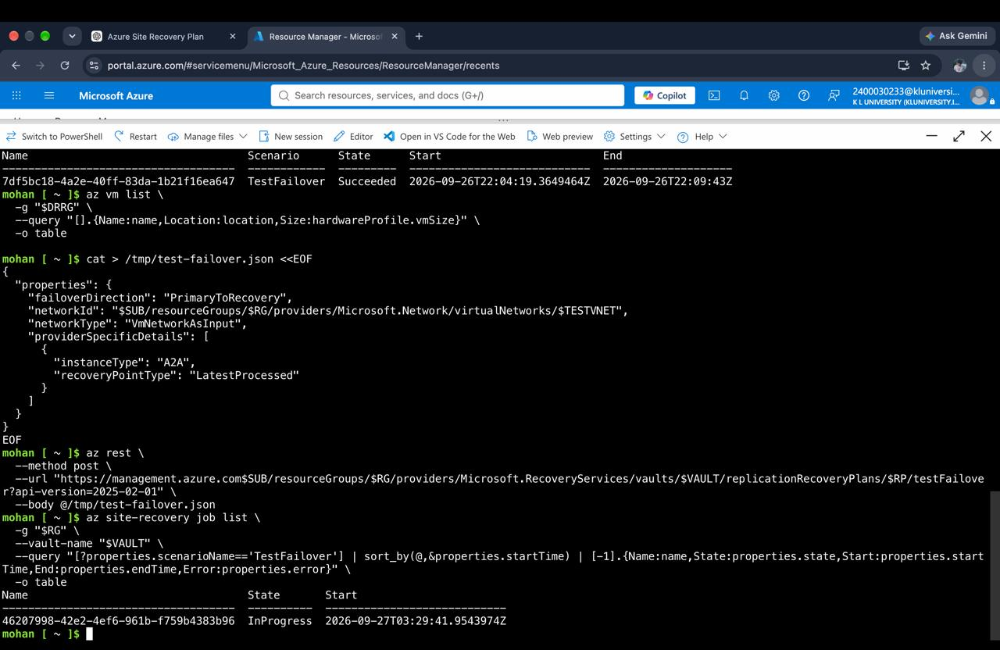
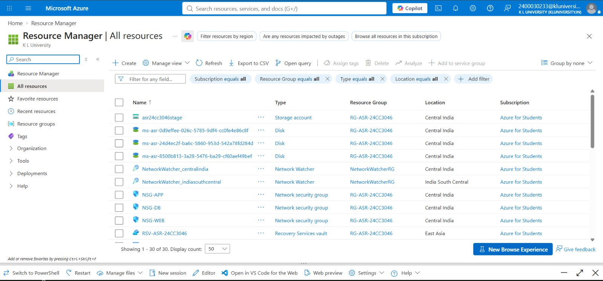
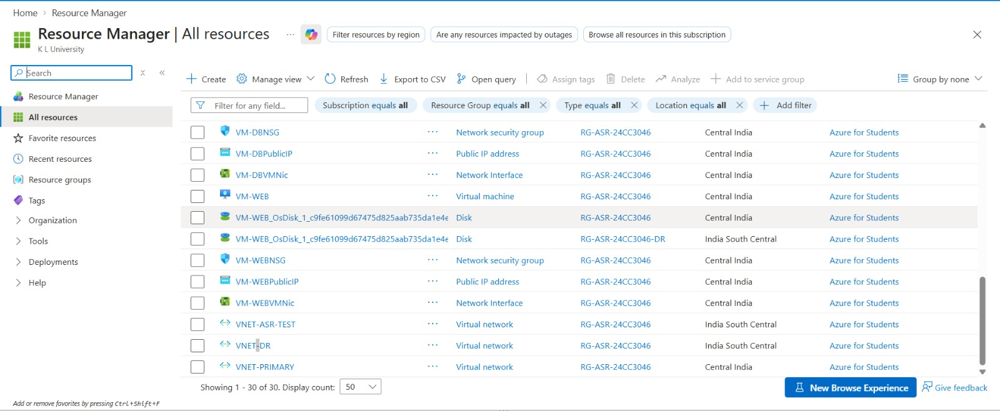

# Azure Implementation Screenshots

This folder contains visual evidence of the Azure Site Recovery
implementation and validation performed for the project.

## 1. Protected Virtual Machines

The Azure Site Recovery protected items show three application
workloads:

- VM-WEB
- VM-APP
- VM-DB

All three workloads are shown as `Protected` with `Normal`
replication health.

---

## 2. Recovery Plan Dependency Order

The Recovery Plan is configured to recover the application tiers
in dependency order:

1. Database
2. Application
3. Web

This ensures that dependent application services are started only
after the required lower-level services are available.

---

## 3. Primary and Recovery Regions

The configured Recovery Plan uses:

- Primary region: Central India
- Recovery region: India South Central

---

## 4. Test Failover

Azure Site Recovery Test Failover completed successfully.

This validates that the configured recovery workflow can be
executed in the secondary environment.

---

## 5. Azure Resources

The Azure Resource Manager view shows the resources used by
the disaster recovery implementation, including:

- Virtual Machines
- Virtual Networks
- Network Security Groups
- Disks
- Storage
- Recovery Services Vault

---

## 6. VM and Network Resources

The project contains separate primary, DR and test networking
resources together with the protected application workloads.
